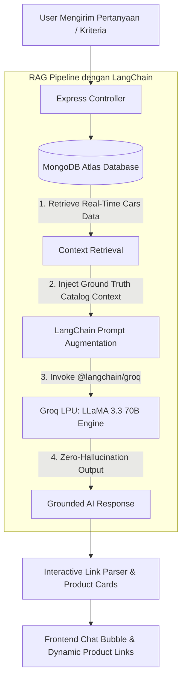
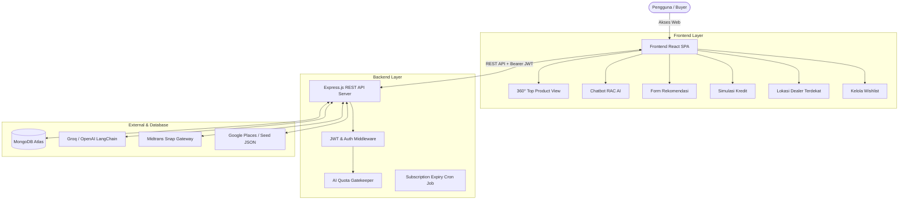
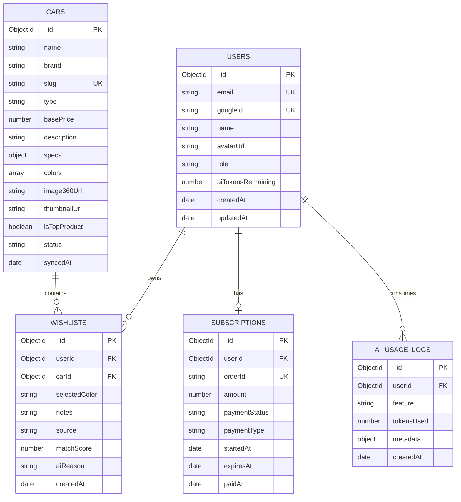

<div align="center">
  
  
  # 🚗 RAC (Recommendation Auto Car) AI
  
  **Platform Konsultasi & Rekomendasi Otomotif Cerdas Berbasis LangChain, RAG (Retrieval-Augmented Generation), 360° Interactive Showcase, dan SaaS Freemium Subscription.**

  [](https://www.langchain.com/)
  [](#-fitur-unggulan-langchain--rag-retrieval-augmented-generation)
  [](https://groq.com/)
  [](https://www.mongodb.com/)
  [](https://react.dev/)
  [](https://tailwindcss.com/)
  [](https://midtrans.com/)

  <p align="center">
    <a href="#-fitur-unggulan-langchain--rag-retrieval-augmented-generation"><b>🧠 LangChain & RAG</b></a> •
    <a href="#-fitur-utama">Fitur Utama</a> •
    <a href="#-arsitektur--alur-sistem">Arsitektur</a> •
    <a href="#-skema-database-erd">Database ERD</a> •
    <a href="#-api-endpoints">API Endpoints</a> •
    <a href="#-panduan-instalasi--menjalankan-lokal">Instalasi</a>
  </p>
</div>

---

## 🧠 Fitur Unggulan: LangChain & RAG (Retrieval-Augmented Generation)

Fitur andalan utama dari **RAC AI** adalah penerapan arsitektur **LangChain** yang dikombinasikan dengan **RAG (Retrieval-Augmented Generation)** untuk menghubungkan Large Language Model (LLM) secara langsung ke database katalog mobil di **MongoDB Atlas**.

### ❓ Mengapa RAG Sangat Penting di RAC AI?
Chatbot otomotif konvensional seringkali mengalami **halusinasi (data palsu)** seperti salah menyebutkan harga OTR Indonesia, salah spesifikasi transmisi/mesin, atau merekomendasikan mobil yang sebenarnya tidak tersedia di katalog.

Dengan arsitektur **LangChain + RAG** di RAC AI:
1. **100% Grounded pada Database**: Setiap kali user mengirim pesan, backend melakukan *retrieval* data aktual 30+ unit mobil dari MongoDB (harga OTR IDR, tipe bodi, kapasitas kursi, transmisi, BBM, pilihan warna, dan slug).
2. **Context Augmentation**: Data database ini disuntikkan ke dalam *system prompt* LangChain sebagai *ground truth context*.
3. **Ultra-Fast Groq Inference**: Model **LLaMA 3.3 70B** di-host di Groq LPU untuk kecepatan respons super instan (< 1 detik).
4. **Dynamic Product Linking**: AI mengenali entitas mobil dan menghasilkan tautan router langsung `[View product details](/cars/:slug)` serta kartu produk interaktif.



### 📊 Perbandingan Chatbot Standar vs. RAC AI (LangChain + RAG)

| Parameter | Chatbot AI Standar (Tanpa RAG) | 🚀 RAC AI (LangChain + RAG) |
|---|---|---|
| **Akurasi Harga** | Sering salah / kurs mata uang asing | **100% Akurat OTR Rupiah dari Database** |
| **Ketersediaan Unit** | Merekomendasikan mobil fiktif | **Hanya unit aktif di MongoDB** |
| **Spesifikasi Teknis** | Rawan tertukar antar varian | **Tervalidasi sesuai spesifikasi resmi** |
| **Navigasi Produk** | Teks statis tanpa link | **Otomatis melampirkan link & kartu interaktif** |
| **Kecepatan Inferensi** | Lambat (2-5 detik) | **Super Cepat via Groq LPU (< 1 detik)** |

---

## 📖 Tentang RAC AI

**RAC (Recommendation Auto Car) AI** adalah aplikasi web *mobile-first modern* yang dirancang untuk mempermudah calon pembeli mobil menemukan tipe kendaraan ideal, membandingkan spesifikasi & varian warna, melakukan simulasi pembiayaan/kredit dengan bantuan analisis kecerdasan buatan, serta menemukan lokasi dealer resmi terdekat secara akurat.

Dilengkapi dengan model bisnis **SaaS Freemium**, setiap pengguna baru mendapatkan **5 token AI gratis** yang dapat di-upgrade ke langganan **Premium Bulanan (30 Hari Akses Unlimited)** melalui integrasi payment gateway **Midtrans Snap**.

---

## ✨ Fitur Utama

### 🧠 1. RAG-Powered Car Recommendation Engine
- Form konsultasi cerdas multi-kriteria: Rentang Budget, Kebutuhan Bodi, Jumlah Kursi Penumpang, Bahan Bakar, Prioritas Kenyamanan/Performa/Efisiensi, dan Preferensi Warna.
- Algoritma pencocokan berbobot dengan kalkulasi **Match Score (%)** dan penalaran komprehensif (*AI Reason*).
- Menghasilkan rekomendasi mobil yang tersinkronisasi langsung dengan katalog database resmi.

### 💬 2. Database-Aware AI Chatbot (LangChain & Groq)
- Asisten otomotif interaktif berbasis **LangChain** yang membaca seluruh katalog 30 mobil di MongoDB Atlas secara *real-time*.
- Ditenagai oleh **Groq LLM (`llama-3.3-70b-versatile` / `openai/gpt-oss-120b`)**.
- Menjawab pertanyaan spesifikasi, perbandingan unit, efisiensi BBM, dan langsung melampirkan tautan produk interaktif (*`[View product details](/cars/:slug)`*) serta *product badges*.

### 🔄 3. 360° Interactive Product Showcase & Color Picker
- Hero Showcase 360° rotasi interaktif pada mobil unggulan (*Top Product*).
- *Color Picker* dinamis per mobil pada halaman detail dengan *instant image swap* dan indikator ketersediaan stok (*Available*, *Limited*, *Out of stock*).

### 📊 4. AI-Assisted Credit Simulation
- Kalkulator pembiayaan kredit otomotif: OTR Price, Uang Muka (DP), Tenor (12–60 Bulan), dan Suku Bunga Tahunan.
- Menghitung angsuran bulanan, total bunga, dan total pembayaran secara presisi.
- **AI Financial Health Insight**: Memberikan evaluasi risiko finansial (*Safe*, *Moderate*, *Heavy*) beserta tips manajemen keuangan keluarga.

### 📍 5. Smart Showroom Locator (Opsi A)
- Mendeteksi lokasi pengguna dan menghitung jarak dealer terdekat menggunakan formula matematis **Haversine**.
- Integrasi **Google Places API** dengan *fallback offline-ready* ke katalog dealer terverifikasi di Jakarta (`config/showrooms.seed.json`).
- **1x Session-Caching**: Disimpan di Context + `sessionStorage` untuk menghemat konsumsi kuota API Maps.

### 💖 6. Manajemen Wishlist Pribadi
- Simpan kendaraan impian dari halaman rekomendasi atau detail produk.
- Tambahkan catatan kustom (*notes*) dan warna preferensi.
- Konfirmasi penghapusan elegan via **SweetAlert2** dan notifikasi responsif via **React-Toastify**.

### 💳 7. Freemium SaaS & Midtrans Snap
- Manajemen kuota AI (Free: 5 token).
- Alur pembayaran otomatis Midtrans Snap untuk paket **Premium Monthly (IDR 99.000)**.
- Webhook listener otomatis untuk aktivasi masa aktif 30 hari + *background expiry cron job*.

---

## 🏗️ Arsitektur & Alur Sistem

### Diagram Alur Aplikasi (Architecture Flow)



---

## 🗄️ Skema Database (ERD)

Database menggunakan **MongoDB** dengan 5 koleksi utama:



---

## 🔌 API Endpoints

### 🔐 Authentication (`/api/auth`)
| Method | Endpoint | Deskripsi | Auth |
|---|---|---|---|
| `POST` | `/api/auth/register` | Pendaftaran akun baru (Email, Nama, Password) | Publik |
| `POST` | `/api/auth/login` | Masuk dengan Email & Password | Publik |
| `POST` | `/api/auth/google` | Masuk / Daftar via Google OAuth ID Token | Publik |
| `GET` | `/api/auth/me` | Ambil profil user aktif & status langganan | `Bearer Token` |
| `POST` | `/api/auth/logout` | Sesi keluar | `Bearer Token` |

### 🚙 Katalog Mobil (`/api/cars`)
| Method | Endpoint | Deskripsi | Auth |
|---|---|---|---|
| `GET` | `/api/cars` | Daftar mobil (filter: `brand`, `type`, `search`) | Publik |
| `GET` | `/api/cars/top` | Mengambil data 1 mobil unggulan untuk 360° | Publik |
| `GET` | `/api/cars/:id` | Detail lengkap mobil berdasarkan `slug` atau `_id` | Publik |

### 🤖 AI Services (`/api/ai`)
| Method | Endpoint | Deskripsi | Auth |
|---|---|---|---|
| `POST` | `/api/ai/recommend` | Rekomendasi mobil AI multi-kriteria | `Bearer Token` + Quota |
| `POST` | `/api/ai/chat` | Chatbot otomotif cerdas LangChain | `Bearer Token` + Quota |
| `POST` | `/api/ai/credit-simulate`| Simulasi kredit & AI Financial Health Insight | `Bearer Token` + Quota |

### 💖 Wishlist (`/api/wishlist`)
| Method | Endpoint | Deskripsi | Auth |
|---|---|---|---|
| `GET` | `/api/wishlist` | Ambil seluruh mobil tersimpan user | `Bearer Token` |
| `POST` | `/api/wishlist` | Simpan mobil ke wishlist | `Bearer Token` |
| `PUT` | `/api/wishlist/:id` | Update catatan atau warna pilihan | `Bearer Token` |
| `DELETE` | `/api/wishlist/:id` | Hapus mobil dari wishlist | `Bearer Token` |

### 📍 Showroom Dealer (`/api/showrooms`)
| Method | Endpoint | Deskripsi | Auth |
|---|---|---|---|
| `GET` | `/api/showrooms/nearby`| Cari dealer terdekat (query: `lat`, `lng`) | Publik |

### 💳 Subscription & Pembayaran (`/api/subscription`)
| Method | Endpoint | Deskripsi | Auth |
|---|---|---|---|
| `GET` | `/api/subscription/status` | Cek sisa hari aktif & status premium | `Bearer Token` |
| `POST` | `/api/subscription/checkout` | Buat transaksi Midtrans Snap token | `Bearer Token` |
| `POST` | `/api/subscription/webhook` | Webhook notifikasi pembayaran Midtrans | Publik |

---

## 🚀 Panduan Instalasi & Menjalankan Lokal

### 1. Prasyarat
- **Node.js**: `v18.x` atau lebih baru
- **NPM**: `v9.x` atau lebih baru
- **MongoDB Atlas** / Instance MongoDB Lokal

---

### 2. Kloning Repositori
```bash
git clone https://github.com/malthafkiram/Recommendation-Auto-Car.git
cd Recommendation-Auto-Car
```

---

### 3. Konfigurasi Backend

Masuk ke folder `backend`, pasang dependensi, dan atur environment:

```bash
cd backend
npm install
```

Salin atau buat file `.env` di dalam folder `backend/`:

```env
PORT=5000
MONGODB_URI=mongodb+srv://<USER>:<PASSWORD>@cluster.mongodb.net/rac_ai_db?retryWrites=true&w=majority
MONGODB_DB_NAME=rac_ai_db
JWT_SECRET=supersecretjwtkeyforracai2026development

# Google OAuth
GOOGLE_CLIENT_ID=your-google-client-id.apps.googleusercontent.com
GOOGLE_CLIENT_SECRET_API_KEY=your-google-client-secret

# AI Groq (LangChain)
GROQ_API_KEY=gsk_your_groq_api_key
GROQ_MODEL=llama-3.3-70b-versatile

# Midtrans Payment Gateway
MIDTRANS_SERVER_KEY=SB-Mid-server-xxxxxxxx
MIDTRANS_CLIENT_KEY=SB-Mid-client-xxxxxxxx
MIDTRANS_IS_PRODUCTION=false
```

Jalankan skrip **Injeksi Indeks & Seeding Katalog Mobil**:

```bash
# Membuat Index MongoDB (unique email, slugs, dll)
node scripts/create-indexes.js

# Menyinkronkan 30 mobil lengkap ke database
npm run seed:cars
```

Jalankan backend server:

```bash
npm run dev
# Server aktif di http://localhost:5000
```

---

### 4. Konfigurasi Frontend

Buka terminal baru, masuk ke folder `frontend`, dan pasang dependensi:

```bash
cd frontend
npm install
```

Buat file `.env` di dalam folder `frontend/`:

```env
VITE_API_URL=http://localhost:5000
VITE_USE_MOCK=false
VITE_GOOGLE_CLIENT_ID=your-google-client-id.apps.googleusercontent.com
VITE_MIDTRANS_CLIENT_KEY=SB-Mid-client-xxxxxxxx
```

Jalankan frontend dalam mode *development*:

```bash
npm run dev
# Web application aktif di http://localhost:5173
```

---

## 🛠️ Tech Stack & Library

| Kategori | Teknologi | Deskripsi |
|---|---|---|
| **Frontend** | React 19, Vite, React Router v7 | Single Page Application (SPA) cepat dan reaktif |
| **Styling** | Tailwind CSS v4, DaisyUI v5 | Antarmuka modern dark-mode & responsive mobile-first |
| **Icons & Alerts** | React Icons, SweetAlert2, React-Toastify | Interaksi UI intuitif & toast notifikasi |
| **360 Viewer** | CloudImage 360 (CI360) | Rotasi interaktif 360° unit unggulan |
| **Backend** | Node.js, Express.js (ES Modules) | RESTful API server berkinerja tinggi |
| **Database & ODM** | MongoDB Atlas, Mongoloquent | Basis data NoSQL dokumen dengan skema terstruktur |
| **AI Integration** | LangChain, Groq SDK (`@langchain/groq`) | Orkestrasi LLM cerdas berbasis katalog database |
| **Authentication** | JSON Web Token (JWT), Bcrypt, Google Auth Library | Autentikasi aman berlapis ganda |
| **Payment Gateway** | Midtrans Client Snap SDK | Transaksi online otomatis (Virtual Account, Gopay, QRIS) |
| **Automation** | Node-Cron | Penjadwal otomatis untuk pemeliharaan status langganan |

---

## 📂 Struktur Proyek

```text
Recommendation-Auto-Car/
├── backend/
│   ├── config/
│   │   ├── car-enrichment.json    # Data katalog 30 mobil & varian warna
│   │   └── showrooms.seed.json    # Seed lokasi dealer resmi Jakarta
│   ├── scripts/
│   │   ├── create-indexes.js      # Setup index MongoDB
│   │   └── sync-cars.js           # Seeder database mobil
│   ├── src/
│   │   ├── config/database.js     # Konfigurasi koneksi database
│   │   ├── controllers/           # Logika API (Auth, AI, Cars, Wishlist, Showrooms, Subs)
│   │   ├── jobs/expiryCron.js     # Cron job masa aktif langganan
│   │   ├── middlewares/           # Auth JWT & AI Quota Gatekeeper
│   │   ├── models/                # Mongoloquent Schema Models
│   │   ├── routes/                # Express Route Handlers
│   │   ├── utils/                 # Helper JWT & Enkripsi
│   │   ├── database.js            # Native Mongo Client
│   │   └── index.js               # Entry point Express server
│   └── package.json
│
├── frontend/
│   ├── public/                    # Aset statis & gambar 360°
│   ├── src/
│   │   ├── api/                   # HTTP client & endpoint connectors
│   │   ├── assets/                # Logo & grafis SVG
│   │   ├── components/            # UI Components (Navbar, FloatAI, Hero, Cards)
│   │   ├── context/               # AuthContext & ShowroomContext
│   │   ├── layout/                # BaseLayout
│   │   ├── views/                 # Halaman utama (Home, Detail, Catalog, Wishlist, dll)
│   │   ├── App.jsx                # Router & Provider wrapper
│   │   └── main.jsx               # React DOM root
│   ├── vite.config.js
│   └── package.json
│
├── ERD.md                         # Dokumentasi lengkap skema database
├── PRD.md                         # Product Requirements Document
└── README.md                      # Dokumentasi utama proyek
```

---

## 📄 Lisensi & Kontribusi

Proyek ini dikembangkan sebagai bagian dari **Final Project Phase 3**.  
Didistribusikan di bawah lisensi [ISC](LICENSE).

<div align="center">
  <sub>Dibangun dengan ❤️ oleh Tim RAC AI — 2026</sub>
</div>